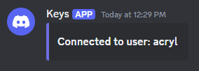
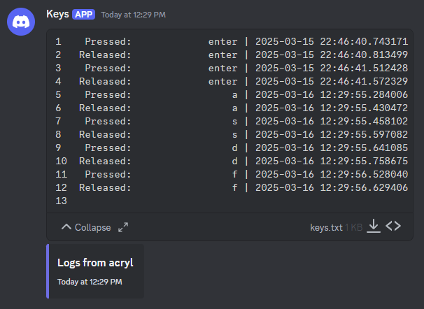

# Keylogger  
**I do NOT condone or encourage anyone to use this project for malicious purposes.** This project was purely created to see if I could do it, please don't get in trouble.  
# Features  
## Logging  
Whenever a key is input, the key name, time it was pressed/released, and whether it was pressed or released it is stored to a file in a folder in the user directory, where someone would hopefully not think to check.  

Example file:  
```
 Pressed:                 e | 2025-03-16 12:29:56.943361
Released:                 e | 2025-03-16 12:29:57.039482
 Pressed:                 h | 2025-03-16 12:44:42.791783
Released:                 h | 2025-03-16 12:44:43.112346
 Pressed:                 a | 2025-03-16 12:44:43.611056
 Pressed:                 s | 2025-03-16 12:44:43.678358
Released:                 a | 2025-03-16 12:44:43.813915
Released:                 s | 2025-03-16 12:44:43.853908
 Pressed:                 f | 2025-03-16 12:44:43.869614
Released:                 f | 2025-03-16 12:44:43.978421
 Pressed:                 q | 2025-03-16 12:44:44.305958
Released:                 q | 2025-03-16 12:44:44.423989
 Pressed:                 a | 2025-03-16 12:44:44.878356
Released:                 a | 2025-03-16 12:44:45.042895
 Pressed:                 s | 2025-03-16 12:44:45.094445
 Pressed:                 f | 2025-03-16 12:44:45.278438
Released:                 s | 2025-03-16 12:44:45.323307
...
```
This also works when it comes to hotkeys. By default, if you were to input the `ctrl+c` hotkey, it would log as something like this:  
```
 Pressed:            ctrl_l | 2025-03-16 12:55:31.640974
 Pressed:            '\x03' | 2025-03-16 12:55:31.850019
Released:            '\x03' | 2025-03-16 12:55:31.942816
Released:            ctrl_l | 2025-03-16 12:55:32.027804
...
```
Through a quite lengthy sequence of elif statements, these hex characters are replaced so that they are logged in a readable format.  

Here's how the log would look for the same hotkey with this added function:  
```
 Pressed:            ctrl_l | 2025-03-16 12:55:31.640974
 Pressed:                 c | 2025-03-16 12:55:31.850019
Released:                 c | 2025-03-16 12:55:31.942816
Released:            ctrl_l | 2025-03-16 12:55:32.027804
...
```
## Discord Notifying  
Through the use of a discord webhook, the program will notify you when it is online on a client.  
  
This message, as seen above, will display the username of the current active user on said client, this way you can easily differentiate who is connected and what logs belong to who.  

Which segues into the next feature, sending logs. Once again, through the same discord webhook the log of key presses and releases is sent.  
  
By default, it is set to send the log once the log file is 300 lines or more (this includes both press and release inputs). After the log is sent, the log file on the client will be emptied so that next time you receive logs from a client they won't have the same inputs you've already received.